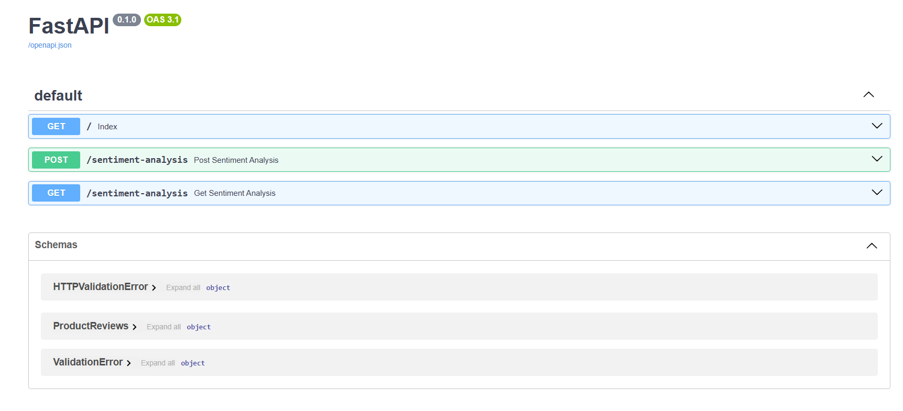
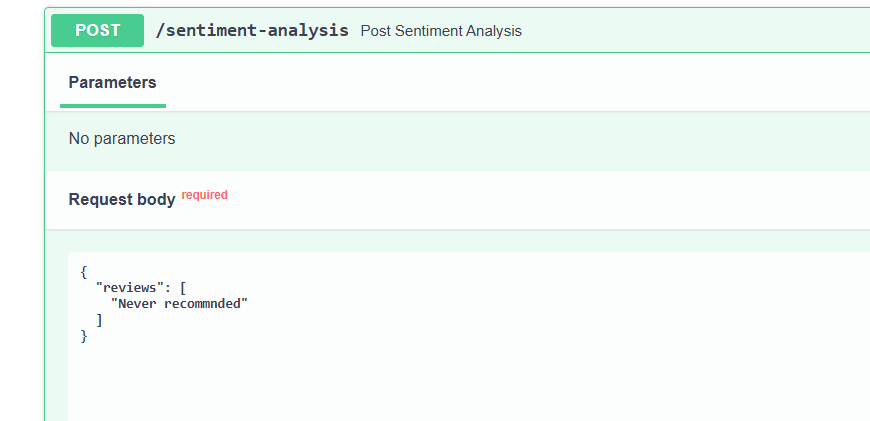
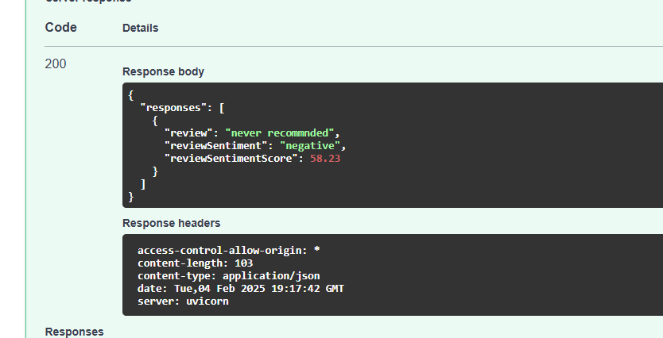
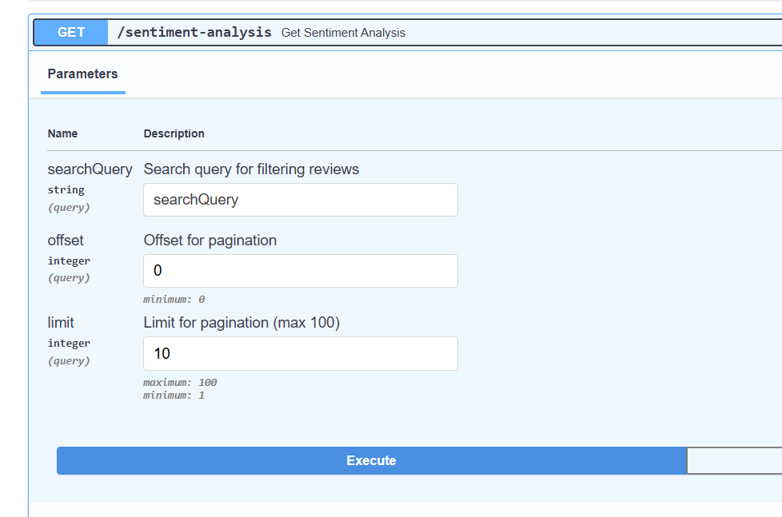
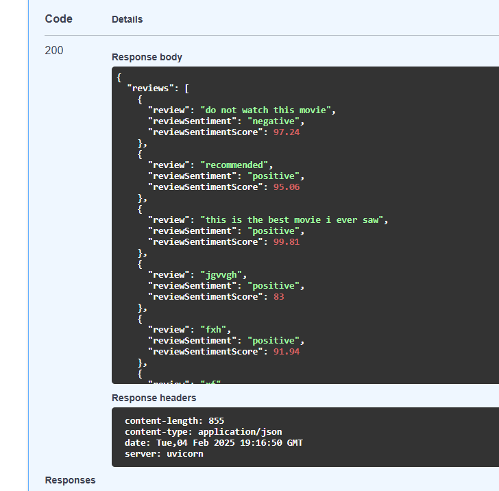

# Sentiment Analysis Backend

## 📌 Overview

This is a **FastAPI** backend for sentiment analysis of movie reviews. It utilizes a **fine-tuned classification model**, trained on open IMDb movie review data available on **Kaggle**. The model is deployed on the **Cohere platform** and serves predictions via API calls.

## 🚀 Features

- **Sentiment Analysis API**: Analyze the sentiment of movie reviews (positive/negative).
- **PostgreSQL Database**: Remote PostgreSQL server deployed on render. Stores previously analyzed reviews for faster retrieval.
- **FastAPI Framework**: Provides a lightweight and efficient REST API.
- **Containerized with Docker**: Easily deploy and run in any environment.
- **Deployed on Render**: Backend runs on Render with a remote PostgreSQL instance.

## 🌐 Live API URL

The backend is deployed and accessible at:

[Sentiment Analysis API](https://sentiment-analysis-backend-nu7h.onrender.com/docs)

## 🏗️ Project Structure

```
📂 sentiment-analysis-backend
├── 📂 app
│   ├── main.py         # FastAPI main application
│   ├── db.py           # Database connection setup and methods (PostgreSQL)
│   ├── 📂 utility
│   │   ├── cohereUtilities.py      # Cohere API utilities for sentiment analysis
│   ├── routes.py       # API endpoints
│── .env            # API keys and database URL (ignored in Git)
├── Dockerfile          # Docker configuration
├── docker-compose.yml  # Docker Compose setup
├── requirements.txt    # Python dependencies
├── README.md           # Project documentation
```

## 🛠️ Local Setup

### 1️⃣ Clone the Repository

```sh
git clone https://github.com/manas-sde/sentiment-analysis-backend.git
cd sentiment-analysis-backend
```

### 2️⃣ Create a `.env` File

Add the following variables inside a **.env** file:

```
COHERE_API_KEY=<your_cohere_api_key>
CLASSIFY_MODEL_ID=<your_cohere_model_id>
DATABASE_URL=<your_postgresql_url>
```

### 3️⃣ Build and Run the Application using Docker

```sh
docker compose up --build
```

### 4️⃣ Access API Docs

Once the server is running, open the API docs in your browser:

```
http://localhost:8000/docs
```

## 📝 API Endpoints

| Method | Endpoint               | Description                              |
|--------|------------------------|------------------------------------------|
| `GET`  | `/`                    | Health check (returns Success!)         |
| `POST` | `/sentiment-analysis`   | Analyze movie review sentiment          |
| `GET`  | `/sentiment-analysis`   | Fetch stored reviews with pagination/search |

## 📸 Screenshots

### 📌 API Documentation (`/docs` in Swagger UI):


### 📌 Sentiment Analysis Response Example:



### 📌 Sentiment Analysis Search Page:



---